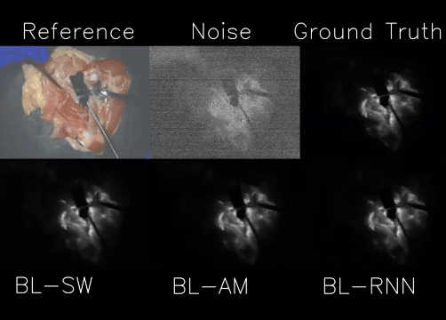
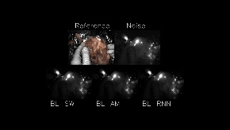

# FGS Denoising
This repo is the code for "Video Denoising in Fluorescence Guided Surgery."

# Getting Started 
## Install
Install Requirements: This repo runs on a linux install with python=3.9.6, cuda=11.6.2
The linux enviorment can be installed with conda:
```
conda env create -f environment.yml
conda activate guided
```
## Get Dataset and Pretrained Models
The dataset and pretrained models are available at: LINK

Unzip the dataset and place the data and model folders at the lowest level of this repository.

## Training
This repo includes code for our 3 baseline models, a model can be trained by running:

```
python train_model.py -epochs 3000 -cpus 16 -batch 4 -model BL_RNN -input ol-2024-condor
```

The model configuration included for training are in model_configs/models. Change the model by changing "BL_RNN" to the name of yaml file of the desired model config.


## Testing
### Metric Results
Testing can be done using the following command:

```
python test_model.py -cpus 6 -batch 1 -input ol-2024-condor-no_crop -test test_models_5by6 
```

To change the settings for testing a new file config file can be added to model_configs/testing.
Metric results are calculated by removing the following indexes of videos. These videos contain no fluorescence so when simualting we add an extra layer of read noise and LLL that are unrealistic so should be taken out of the testing set. Remove indexes: ranges_to_remove = [[155,165],[293,302]]

An example of reading the output of the metric result code is in view_metrics.ipynb
Our metric results for our 3 baseline models, NafNet32, and modified BasicVSR++ are included in results/metric_results.pkl (from the dataset link)


### Save Video Results

```
python save_final_videos.py -s S -l L -device 0
```
where S and L are the number of signal and laser leakage light photons to simualte, respectively. 

### Save Real Videos
To test the models on real video run:

```
python save_final_videos_real.py -device 0
```


## Training LLL-PN
To train the Laser Leakage light prediction network navigate to realistic_fl_noise and run:
```
python train_nafnet_laser_leakage.py -batch 4
```


# Results
> ### S_m=25, L_m=25
> 

> ### Real Data
> 

